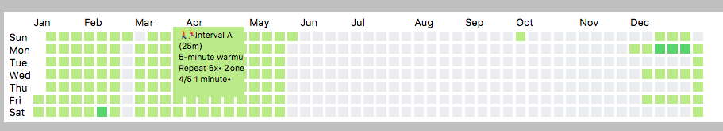

# Schedule



## Import

```
  <head>
    <script src="https://cdnjs.cloudflare.com/ajax/libs/webcomponentsjs/1.0.22/webcomponents-loader.js"></script>
    <link rel="import" href="rohan-schedule.html">
  <head>
```

## Usage

```
  <body>
     <h1>Here is my plan</h1>
     <div>
        <rohan-schedule year="2016" files="/static/assets/plan.ics"></rohan-schedule>
     </div>
  </body>
```